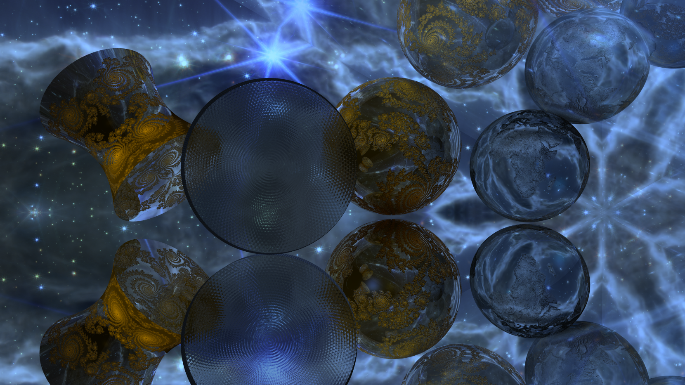

<h1 align="center">MiniRT</h1>


Raytracing offers the opportunity to better understand and mimic real world light transport and interaction, 
enabling the user to create whatever they can imagine, as well as to perform enjoyable thought experiments. 
And being able to do so quickly and satisfyingly is challenging even with modern computers. The ideas that can
be implemented and tried are nearly bottomless. It's the perfect practice/play ground for a programmer.

## Usage

This project is made to run on **Linux** and has only been tested on Ubuntu. It uses **MinilibX**, which has been included in the repo for easy use. 

### Steps to run:

1. **Clone the repository**:
```bash
git clone https://github.com/disinformationalist/Minirt.git miniRT
```

2. **Change to the project directory**:
```bash
cd miniRT
```
3. **Build the executable**:
```bash
make
```
4. **Run with any .rt in the rt_files subdirectory**
example:

```bash
./miniRT each.rt
```
note: any additional .rt files must be placed in the rt_files sub directory.
and any additional textures and height maps must be placed in the textures sub directory.
<br>
further information about the controls can be found below. [#Controls and Documentation](#controls-and-documentation)

## Features
- Phong shading model (Ambient + Diffuse + Specular)
- Material Shading with 7 adjustable properties
- 5 adjustable object primitives
	- Spheres
	- Planes
	- Cylinders
	- Hyberboloids (adjustable to one sheet, two sheets, double cone)
	- Cubes
- Camera operates in first person perspective for moving, rotating, and adjusting Field of View at runtime
- Handling of any combination and number of point, spot(hard or soft via adjustment), and area lights
- Recursive reflection and refraction fully handled for all configurations and embedded objects, and adjusted for Fresnel effect
- Texture mapping
- Checkers for all objects and orientations
- Bump mapping
	- Default luminosity based bump mapping when no height map is provided
	- Bump mapping handled for any material for creation of embossed reflective and/or refractive materials
- Supersampling(antialiasing) and Low resolution mode, adjustable level for each
- Hard and soft shadows (soft when using area lights)
- Multithreaded processing
- PNG export and import
- A GUI to allow full control over the scene
- A Bounding Volume Hierarchy acceleration structure to allow for scenes with many objects.
- The ability to use, create, modify, and destroy everything at runtime without needing to exit

## Code Structure

### Parsing

Parsing is done by splitting the .rt file into a 3d array comprised of lines, groups, and individual characters 
=> Array[line][group][character], then checking all parameters for validity, building list structures, 
and finally performing assignment of values.

This allows for easy access as well as flexibility for future modification such as adding more parameters,
changing parameters or functionality, as the arrays dimensions can be any size.

### Data Structuring and Methodology

All objects, lights, and textures are placed in doubly linked circular lists for greater control over, easy navigation, 
and improved ability to maintain and optimize.

The number of threads automatically sets to the number of cores on the machine being used. 
Threads are set with individual structs containing copies of needed data and the limits unique to that thread, 
based upon the current needs such as screen resolution, whether or not the gui is open, which mode is in 
use(low res, normal, or super) eliminating the need for expensive mutexes. After joining, adjustments 
such as rotations, scales, translations, texture assigments and all other parameter changes are made before 
the rendering process begins again.

Singly scaled object space is used for computing intersections. All intersections per ray are maintained in a list
that is kept sorted at all times using a simple insertion sort. This is important for correct handling of refraction.
List size is determined by the maximum possible number of intersections a ray might have, and adjusts as needed between renders.

Matrix transformations are packed into column major 1d arrays and used to achieve all operations on objects, except for the camera
which has been handled separately for optimization purposes. A few other optimizations are leveraged where possible, such as use of a
bounding volume hierarchy, performing light computations for spotlights only within illuminated areas, caching computations for reuse, 
not performing computation for pixels filled by the GUI while open in all modes normal, low res, and super, The multithreading never 
requires use of costly mutexes, math optimizations, etc.

The hierarchy uses a k-d tree structure for balanced space partitioning. First, a minimum bounding box is placed 
around all objects(excluding planes). A split occurs along the center of the largest axis
when the current box(and its object group) contains 4 or more primitive objects. Each level is a doubly linked circular list,
containing a left subgroup, right subgroup, and those objects which fall along the split axis. 
these are placed into a third group and another hierarchy branch built from it if it contains 3 or more objects, 
and a left and/or right subgroup exists, this check preventing an infinite loop.
Each of these 3 (or 2) branches are reboxed in the tightest box that contains their object sets.
The result is a BVH which is binary at some branches and ternary at others, and while there are better, more elaborate
bvh schemes, this one manages to have tight boxes with minimal overlap, is conceptually straightforward, builds quickly, 
and is very effective. The hierarchy is rebuilt whenever an object is pushed, popped, translated, rotated, or scaled.
And makes larger scenes like the sphereflake(4187 spheres), seen in some images below, possible in minutes at 
100 samples per pixel and only 4 threads.

## Controls and Documentation

Click thumbs to view full size.

The GUI opens into the top left corner panel as in the first image, the next three images show some of the other gui screens that can be accessed.


<a href="readme_imgs/custom.png">
  
</a>
<a href="readme_imgs/rmcons.png">
  
</a>
<a href="readme_imgs/rmdials.png">
  
</a>
<a href="readme_imgs/rmcons2.png">
  
</a>

<br>

Documentation for controls is accessible at runtime the two accessible guides shown in the left image.
A simple .rt file with one of each possible object and 3 textures is shown in the right.

<a href="readme_imgs/guides.png">
  
</a>
<a href="readme_imgs/rt.png">
  
</a>


## Sample Images




